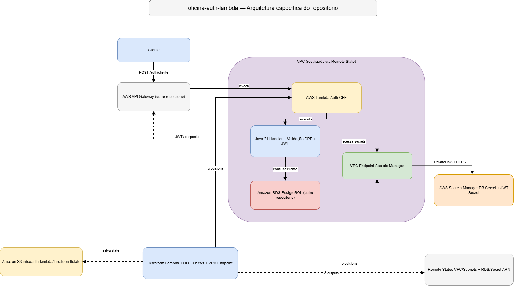

# Oficina Dinoco - Auth Lambda

Function Serverless responsável pelo fluxo de autenticação dos **clientes da Oficina Dinoco**.

Este repositório faz parte da Fase 3 do projeto e complementa a aplicação principal `oficina-dinoco`, mantendo isolado o fluxo serverless de autenticação por CPF.

---

## 🎯 Objetivo do repositório

Este repositório é responsável por:

- receber CPF através do API Gateway;
- validar matematicamente o CPF;
- consultar o cliente no PostgreSQL;
- verificar se o cliente existe e está ativo;
- obter segredos no AWS Secrets Manager;
- emitir JWT do tipo `CLIENTE`;
- executar o fluxo em AWS Lambda;
- provisionar a infraestrutura específica da função com Terraform.

> O API Gateway é provisionado no repositório `oficina-infra-k8s`. O PostgreSQL/RDS é provisionado no `oficina-infra-db`.

---

## 🏗️ Arquitetura específica deste repositório



Fluxo principal:

```text
Cliente
  |
  | CPF
  v
API Gateway
  |
  | POST /auth/cliente
  v
AWS Lambda
  |
  +--> Validação do CPF
  |
  +--> Secrets Manager
  |      - credenciais do banco
  |      - segredo JWT
  |
  +--> PostgreSQL RDS
  |      - consulta cliente
  |
  +--> Geração do JWT
          |
          v
       Cliente
```

A Lambda é associada à VPC para acessar o PostgreSQL privado.

Como a função executa dentro da VPC e precisa acessar o Secrets Manager, é utilizado um **VPC Endpoint para Secrets Manager**, evitando a necessidade de NAT Gateway apenas para esse acesso.

---

## 📁 Estrutura do repositório

```text
oficina-auth-lambda/
├── .github/
│   └── workflows/
│
├── src/
│   └── main/
│       └── java/
│           └── com.dinoco.oficina.auth/
│               ├── exception/
│               ├── handler/
│               ├── model/
│               ├── repository/
│               ├── security/
│               └── validation/
│
├── terraform/
│   ├── backend.tf
│   ├── lambda.tf
│   ├── locals.tf
│   ├── outputs.tf
│   ├── providers.tf
│   ├── remote-states.tf
│   ├── secrets.tf
│   ├── security-groups.tf
│   ├── vpc-endpoints.tf
│   └── .terraform.lock.hcl
│
├── pom.xml
└── README.md
```

---

## 🔄 Fluxo de autenticação

A Lambda recebe:

```json
{
  "cpf": "52998224725"
}
```

Fluxo resumido:

1. normaliza o CPF;
2. valida os dígitos verificadores;
3. consulta o cliente no PostgreSQL;
4. confirma que o registro é de pessoa física;
5. verifica se o cliente está ativo;
6. obtém o segredo JWT no Secrets Manager;
7. gera o JWT;
8. devolve o token ao cliente.

---

## 🔐 JWT do cliente

O token utiliza assinatura `HMAC256`.

Principais claims:

- `iss`: emissor do token;
- `sub`: ID interno do cliente;
- `tipo`: `CLIENTE`;
- `iat`: instante de emissão;
- `exp`: instante de expiração.

Exemplo:

```json
{
  "iss": "oficina-api",
  "sub": "11",
  "tipo": "CLIENTE",
  "iat": 1788141203,
  "exp": 1788148403
}
```

O CPF não é armazenado no token.

A aplicação principal utiliza o `sub` como identidade confiável do cliente para realizar autorização por recurso.

---

## 🧩 Principais componentes

```text
handler/
├── ApiGatewayAuthHandler
└── AuthHandler

validation/
└── CpfValidator

repository/
└── ClienteRepository

security/
├── JwtService
├── SecretProvider
└── DatabaseSecretProvider
```

Responsabilidades:

- `ApiGatewayAuthHandler`: adapta o evento recebido do API Gateway;
- `AuthHandler`: coordena o fluxo de autenticação;
- `CpfValidator`: normaliza e valida o CPF;
- `ClienteRepository`: consulta o PostgreSQL via JDBC;
- `DatabaseSecretProvider`: obtém credenciais do banco;
- `SecretProvider`: obtém a chave de assinatura;
- `JwtService`: emite o JWT do cliente.

---

## 🛠️ Tecnologias

- Java 21
- AWS Lambda
- AWS Secrets Manager
- AWS VPC
- AWS PrivateLink / VPC Endpoint
- PostgreSQL / Amazon RDS
- Terraform
- Maven
- Auth0 Java JWT
- JDBC PostgreSQL
- JUnit 5
- Mockito

> O API Gateway participa do fluxo, mas é provisionado em outro repositório.

---

## ☁️ Infraestrutura Terraform

A pasta `terraform/` provisiona os recursos específicos da função:

- AWS Lambda;
- Security Group da Lambda;
- Secret utilizado para assinatura JWT;
- VPC Endpoint para Secrets Manager;
- associação da Lambda às subnets da VPC;
- variáveis de ambiente necessárias para acesso ao RDS e Secrets Manager.

O state utiliza:

```text
infra/auth-lambda/terraform.tfstate
```

A infraestrutura lê Remote States para reutilizar recursos já existentes, principalmente:

- VPC e subnets do `oficina-infra-k8s`;
- endpoint, porta e Secret ARN do banco do `oficina-infra-db`.

Nenhum desses recursos externos é recriado neste repositório.

---

## 🚀 Build

Na raiz:

```bash
mvn clean test
mvn clean package
```

O Maven Shade Plugin gera o JAR com as dependências necessárias para a Lambda.

Exemplo:

```text
target/oficina-auth-lambda-1.0.0.jar
```

---

## 🚀 Deploy

Configure o profile do AWS se necesssário:

```powershell
$env:AWS_PROFILE="profile"
```

Depois:

```bash
cd terraform

terraform fmt
terraform init
terraform validate
terraform plan
terraform apply
```

Quando executado via pipeline, o processo de CI/CD deve realizar o build da aplicação e o provisionamento/atualização da Lambda automaticamente.

---

## 🧪 Teste pelo API Gateway

```http
POST /auth/cliente
Content-Type: application/json
```

```json
{
  "cpf": "52998224725"
}
```

Resposta de sucesso:

```json
{
  "token": "eyJ..."
}
```

### Respostas esperadas

```text
CPF inválido         → HTTP 400
Cliente inexistente  → HTTP 401
Cliente inativo      → HTTP 403
Sucesso              → HTTP 200 + JWT
Erro interno         → HTTP 500
```

---

## 🔒 Segurança

Dados sensíveis não são armazenados diretamente no código ou no Terraform.

A Lambda utiliza referências e configurações como:

```text
JWT_SECRET_ARN
DB_SECRET_ARN
DB_HOST
DB_PORT
DB_NAME
```

Os valores reais são obtidos em tempo de execução no Secrets Manager.

O segredo JWT é compartilhado com a aplicação principal:

```text
Auth Lambda
   ↓
assina JWT

Spring Boot
   ↓
valida JWT
```

> Para fins acadêmicos, o CPF é utilizado como mecanismo de autenticação conforme o requisito. Em um ambiente produtivo, seria recomendável adicionar um segundo fator, pois CPF isoladamente não é uma credencial secreta.

---

## Observabilidade

A função utiliza exceptions para sinalizar falhas durante o fluxo de autenticação.

Quando uma execução da AWS Lambda falha, essas informações podem ser consultadas no Amazon CloudWatch Logs, que registra os eventos e erros da execução da função.

Atualmente, a Lambda não possui uma estratégia própria de logs estruturados.

Dados sensíveis, como CPF completo, JWT, senha do banco e segredo de assinatura, não devem ser incluídos em mensagens de erro ou exceptions.

---

## 🔗 Integração com a aplicação principal

O `oficina-dinoco` continua responsável pela API Spring Boot e pela autorização das rotas.

Fluxo do cliente:

```text
CPF
 ↓
Auth Lambda
 ↓
JWT CLIENTE
 ↓
API Spring Boot
 ↓
Autorização por clienteId
```

A aplicação valida:

1. assinatura e expiração do JWT;
2. claim `tipo=CLIENTE`;
3. `clienteId` presente no `sub`;
4. propriedade do recurso solicitado.

---

## 🔗 Repositórios relacionados

- `oficina-dinoco` — aplicação Spring Boot e regras de negócio.
- `oficina-infra-k8s` — VPC, EKS, ECR, API Gateway e observabilidade Kubernetes.
- `oficina-infra-db` — PostgreSQL RDS e infraestrutura do banco.

A documentação arquitetural completa da solução é mantida no repositório principal `oficina-dinoco`.
